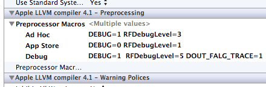

< [Back](../README.md)

dout
=======
<small>ver 2.0.2</small>

Xcode 及 LLDB/GDB 为运行时调试提供了强大的支持，但打印这种相对原始的方式仍然是极为重要且有效的调试手段，效率并不低。

dout 就是专为调试打印而生的工具。

打印方法
----------
打印方法是 dout 的核心，这些方法可分成几类：一类专门打印变量，一类用于跟踪程序执行的轨迹，一类专用于错误、警告输出，另一类是断言增强。

这些打印方法的输出格式专门做了优化（线程名，日期简化），要比直接用 NSLog 好很多。其中 `dout()` 用法跟 NSLog 一致，接受可变参数。

打印变量方法覆盖最常用类型，如打印对象的 `douto()`、打印字符串的 `douts()`、打印指针的 `doutp()` 和其他 dout_<i>type</i>() 方法。

帮助判定程序走向的方法：

* `doutwork()`，用来确定一个函数是否被执行，或用来观察代码执行的顺序，打印被调用的函数名；
* `doutline()`，跟 doutwork 相接近，打印精确到行；
* `douttrace()`，打印调用堆栈，用来判断代码是谁调用的。

错误、警告输出包括 `dout_info()`，`dout_warning()` 和 `dout_error()`。它们的有效性由 `RFDebugLevel` 控制。
`dout_warning()` 和 `dout_error()` 分别有自己的开关用于改变行为：

* 当 `DOUT_TREAT_WANRNING_AS_EXCEPTION` 和 `DOUT_TREAT_ERROR_AS_EXCEPTION` 激活时，会在调用处抛出异常；
* 当 `DOUT_ASSERT_AT_WANRNING` 和 `DOUT_ASSERT_AT_ERROR` 激活时，会在调用处断言失败；
* 断言的优先级高于异常；
* 默认行为只是打印。

断言增强：

包括 `RFALog()` 和 `RFAssert()`，都接受可变参数。当 `RFDEBUG` 激活时，`RFALog()` 会在调用处断言失败，未激活时只是普通的 `NSLog()`。`RFAssert()` 多了一个断言条件，行为与 `RFALog()` 一致。

设置开关
----------
### RFDebugLevel
可以控制 dout 语句是否输出，打印变量的语句要求至少为 `RFDebugLevelError` 才能输出。

### DOUT_FALG_TRACE
当其激活时，会在每个 dout 输出前附加一段调用的位置，用于确定每条语句是在何处打印的。当打印语句较多时可以用于区分，或便于找到某些语句以禁用之。

### DOUT_TRACE_FORMATTER
定义 `DOUT_TRACE_FORMATTER` 激活时附加位置信息的格式。

### 控制 dout_warning、dout_error 行为的开关
DOUT_ASSERT_AT_ERROR，DOUT_ASSERT_AT_WANRNING，DOUT_TREAT_ERROR_AS_EXCEPTION，
DOUT_TREAT_WANRNING_AS_EXCEPTION。
设置为 `1` 以激活。

### 设置开关的建议
默认 `RFDebugLevel` 的级别是 1 ~ 2，建议通过项目设置的 Preprocessor Macros 按需设置，下图是一个例子：

**提示**：你可以在其他代码中重新定义 `RFDebugLevel`，以控制 dout 在相关作用域的行为。

特殊行为
-----
dout 除受以上开关控制外，还与是否处于调试状态有关。

应用处于非调试状态使用 NSLog，会输出到 stderr，被日志系统记录；而在调试状态打印使用 printf 输出到 stdout，不会记录到日志中。在非调试状态 DOUT_FALG_TRACE 无效，不会泄漏语句位置信息。

_dout
------------
大部分 dout 语句都可以通过在前面加一个下划线禁用。

如果要临时禁用而不是删除 dout 语句，`_dout` 可能要比注释更合适。注释的优点是禁用/启用间切换比较快，一个热键搞定。但可能会影响正常注释的阅读，如果到处散乱着这种注释会比较头疼。

而 `_dout` 和正常的 dout 语句都是宏，有相同的特殊配色，容易和其他代码区分开。一致的“`_dout`”前缀搜索也是比较容易的，借助正则表达式替换可以一次性移除所有禁用的 dout 语句。